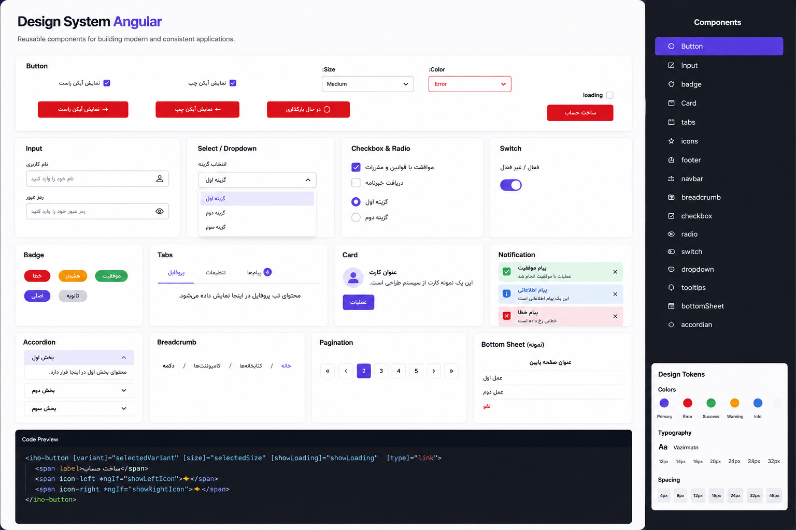

# Design System Angular

<p align="center">
  
</p>

<p align="center">

A modern, reusable and scalable Angular Design System built with **Angular 16**, **TypeScript**, **SCSS** and **Angular Material**.

</p>

<p align="center">

Reusable UI Components • Enterprise Ready • Design Tokens • Responsive • RTL Support

</p>

---

## ✨ Features

- 🎨 Modern UI Components
- 📦 Modular Architecture
- ⚡ Angular 16 Compatible
- 🧩 Enterprise Ready
- 🎯 Design Token Based
- 🎭 SCSS Theming
- 🌙 Easy Customization
- 📱 Responsive Components
- ♿ Accessibility Friendly
- 🌍 RTL Support
- 🚀 High Performance
- 🔥 Production Ready

---

# 🚀 Installation

```bash
npm install @iho/front
```

---

# 📦 Usage

Import only the modules you need.

```typescript
import { ButtonModule } from '@iho/front';

@NgModule({
  imports: [
    ButtonModule
  ]
})
export class AppModule {}
```

Example

```html
<iho-button>
    Submit
</iho-button>
```

---

# 🧩 Available Components

| Component | Status |
|-----------|--------|
| Button | ✅ |
| Input | ✅ |
| Badge | ✅ |
| Card | ✅ |
| Checkbox | ✅ |
| Radio | ✅ |
| Switch | ✅ |
| Chips | ✅ |
| Tabs | ✅ |
| Dropdown | ✅ |
| Tooltip | ✅ |
| Notification | ✅ |
| Accordion | ✅ |
| BottomSheet | ✅ |
| Breadcrumb | ✅ |
| Navbar | ✅ |
| Footer | ✅ |

---

# 📂 Project Structure

```text
projects
└── design-system
    └── src
        ├── assets
        │
        ├── components
        │   ├── accordion
        │   ├── badge
        │   ├── bottomsheet
        │   ├── breadcrumb
        │   ├── button
        │   ├── card
        │   ├── checkbox
        │   ├── chips
        │   ├── dropdown
        │   ├── footer
        │   ├── input
        │   ├── navbar
        │   ├── notification
        │   ├── radio
        │   ├── switch
        │   ├── tab
        │   └── tooltip
        │
        ├── public-api.ts
        ├── design-system.module.ts
        └── design-system.components.ts
```

---

# 🎯 Included Components

### Buttons

- Primary
- Secondary
- Success
- Warning
- Error
- Loading
- Icon Left
- Icon Right

---

### Forms

- Input
- Checkbox
- Radio
- Switch
- Dropdown
- Chips

---

### Navigation

- Navbar
- Breadcrumb
- Tabs

---

### Feedback

- Notification
- Tooltip
- BottomSheet

---

### Layout

- Card
- Accordion
- Footer

---

# 🎨 Design System

The library is built around reusable Design Tokens including:

- Colors
- Typography
- Border Radius
- Shadows
- Spacing
- Icons
- Responsive Sizes

making it easy to maintain a consistent UI across large Angular applications.

---

# 🖥 Preview

The project includes a live showcase application demonstrating every component with configurable examples.

Examples include:

- Component Playground
- Code Preview
- Interactive Controls
- RTL Examples
- Responsive Layouts

---

# 🛠 Tech Stack

- Angular 16
- Angular Material
- Angular CDK
- TypeScript
- RxJS
- SCSS
- ng-packagr

---

# 📦 Build

```bash
npm install
```

Build the library

```bash
npm run build
```

or

```bash
ng build design-system
```

---

# 🧪 Development

Run the showcase application

```bash
npm start
```

---

# 📁 Build Output

```
dist/design-system
```

---

# 📚 Public API

All public components are exported from

```text
projects/design-system/src/public-api.ts
```

Example

```typescript
export * from './lib/components/button/button.component';
export * from './lib/components/button/button.module';

export * from './lib/components/card/card.component';
export * from './lib/components/card/card.module';

export * from './lib/components/chips/chips.component';
export * from './lib/components/chips/chips.module';
```

---

# 🎯 Why This Library?

This Design System was created to provide a scalable UI foundation for enterprise Angular applications.

It helps developers:

- Reduce duplicated code
- Build consistent interfaces
- Increase development speed
- Improve maintainability
- Standardize UI across projects

---

# 🤝 Contributing

Contributions are welcome.

Feel free to open an Issue or submit a Pull Request.

---

# ⭐ Support

If you like this project, consider giving it a **Star** ⭐ on GitHub.

It helps the project grow and motivates future improvements.

---

# 👨‍💻 Author

**Milad Abbasi**

Frontend Engineer

Angular Developer

GitHub

https://github.com/abbasi-milad1372

---

# 📄 License

MIT License